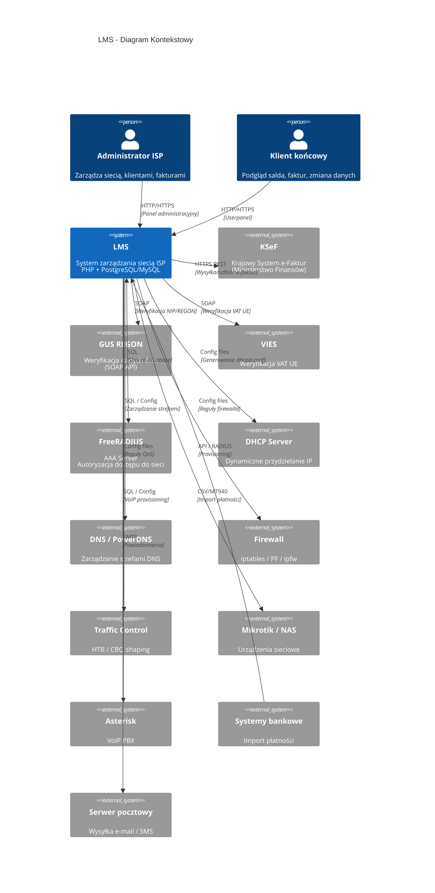
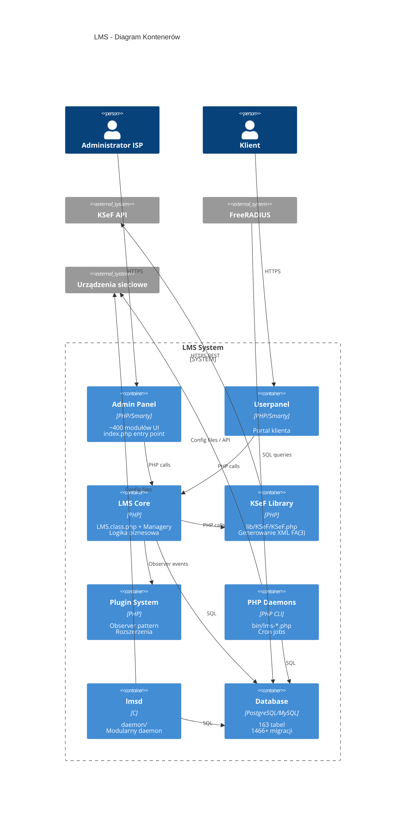
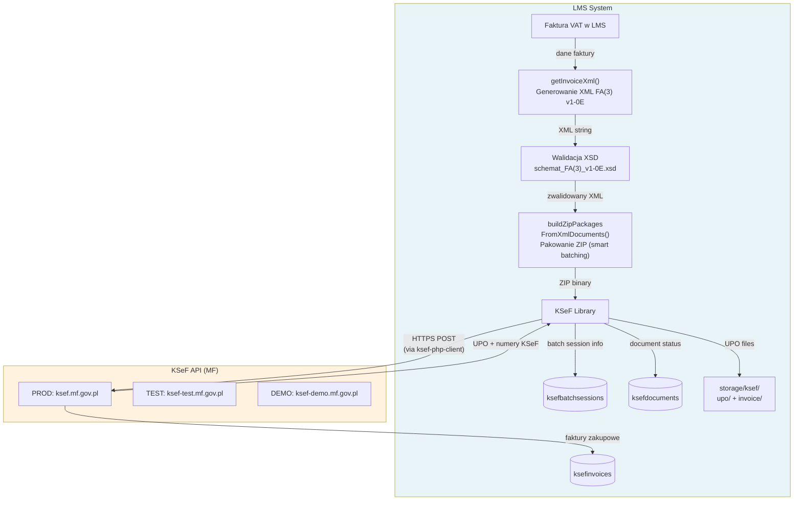
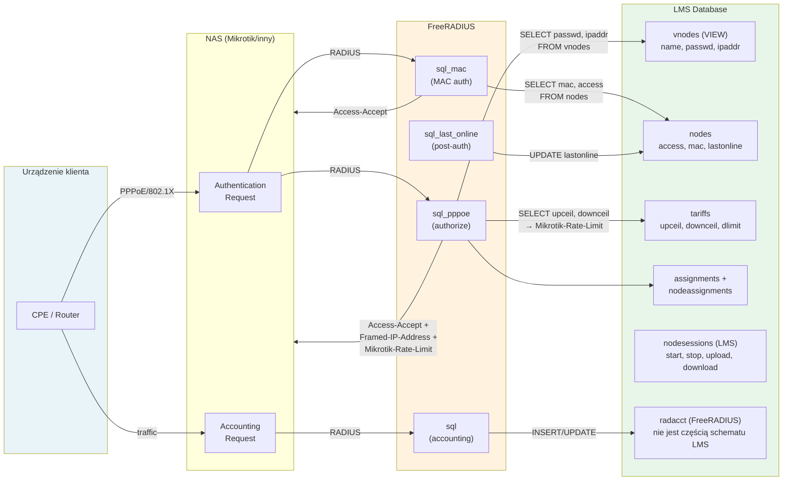
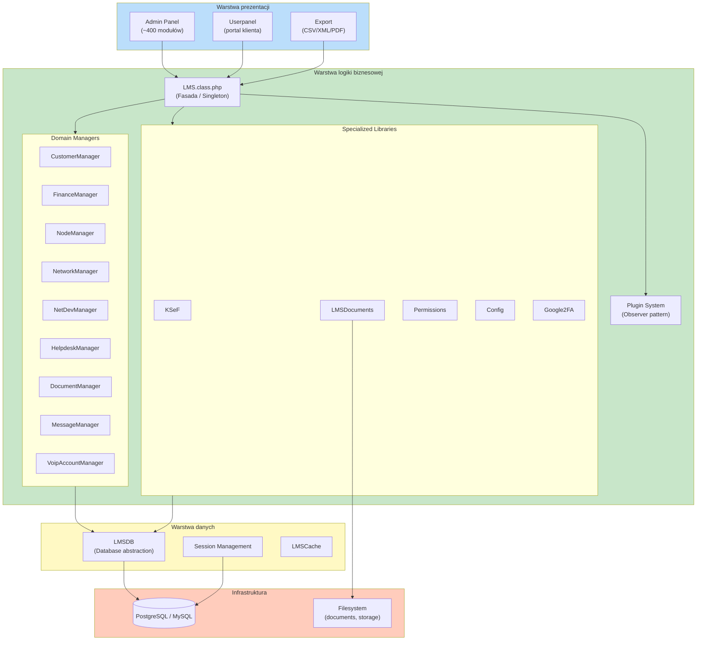
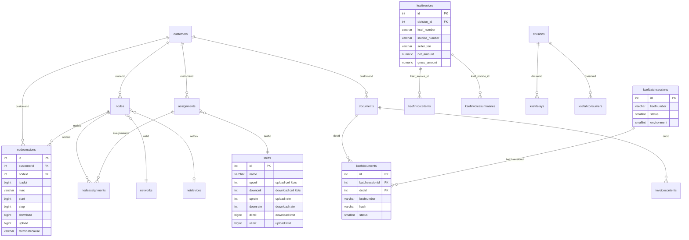
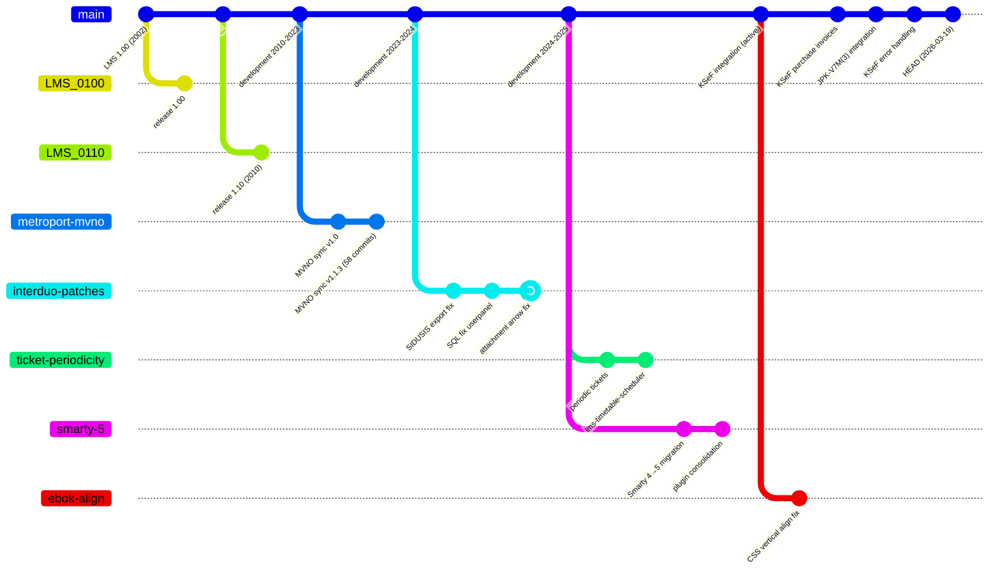
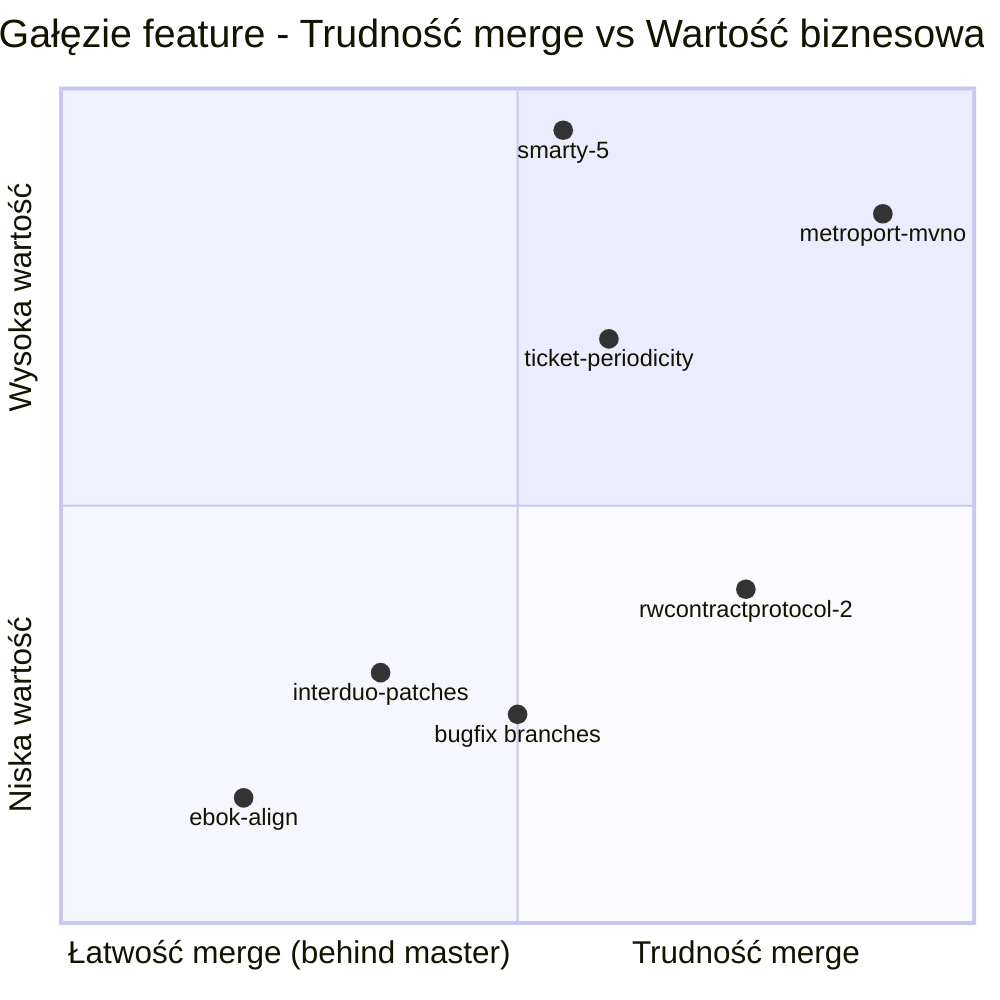

# LMS - Diagramy architektury (Mermaid)

## Diagram kontekstowy (C4 Context)

## Diagram komponentów (C4 Container)

## Diagram przepływu KSeF

## Diagram przepływu RADIUS

## Diagram warstw architektury

## Diagram ERD - kluczowe tabele

## Diagram gałęzi Git

## Macierz gałęzi feature

