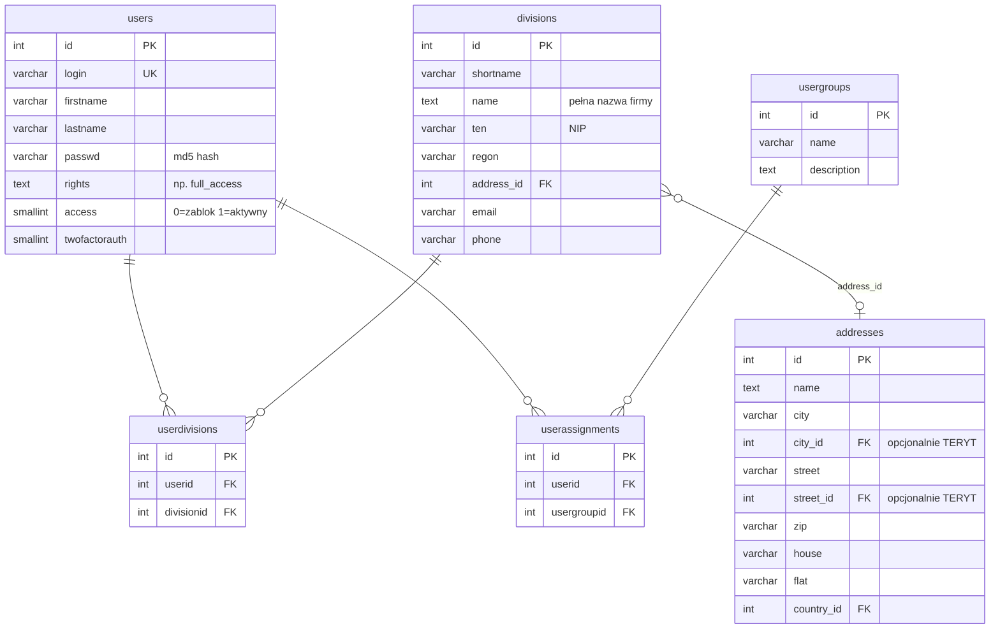
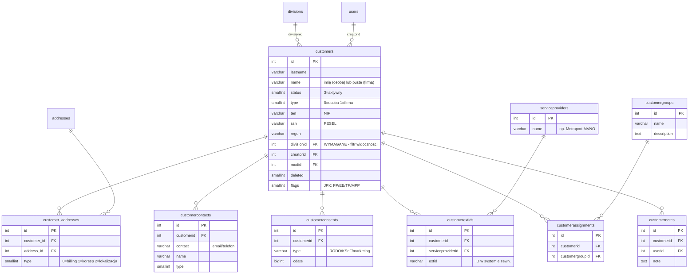
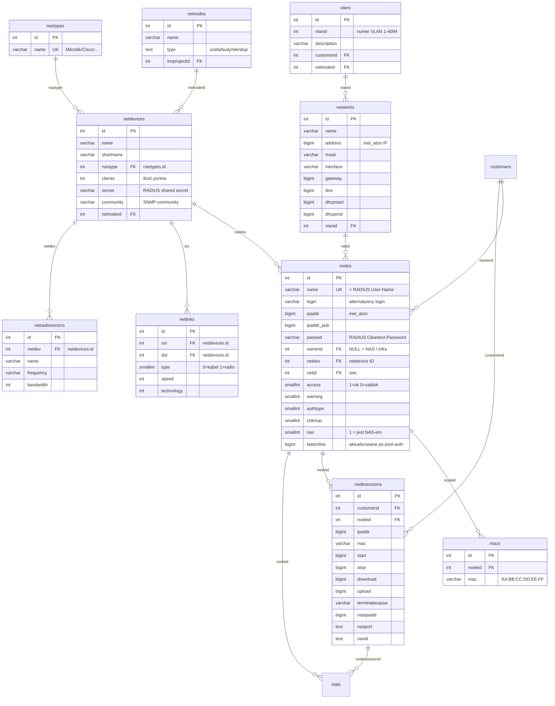
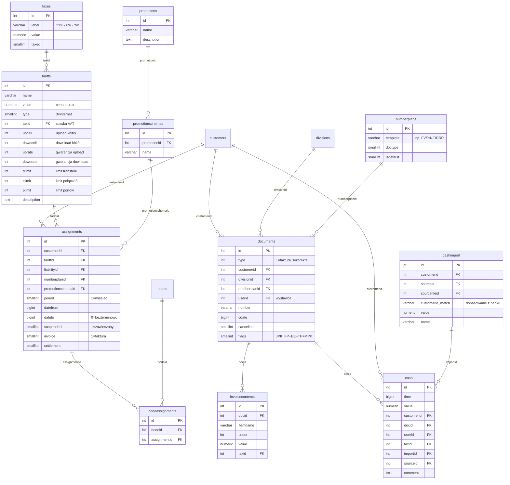
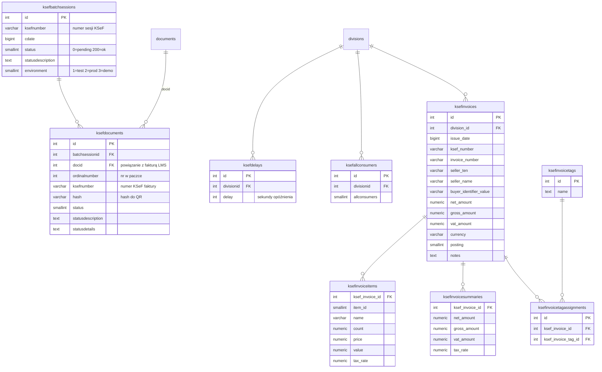
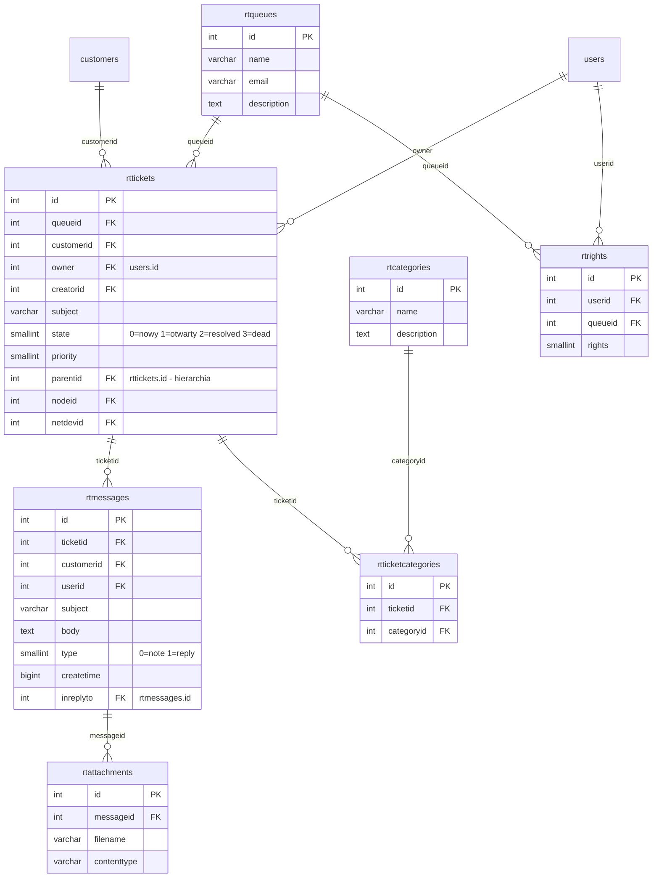
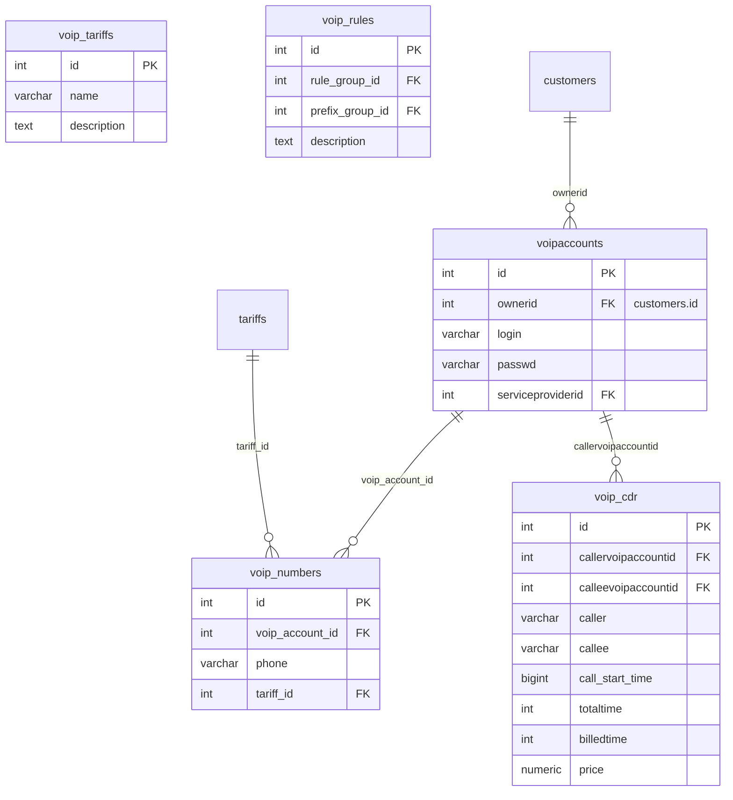
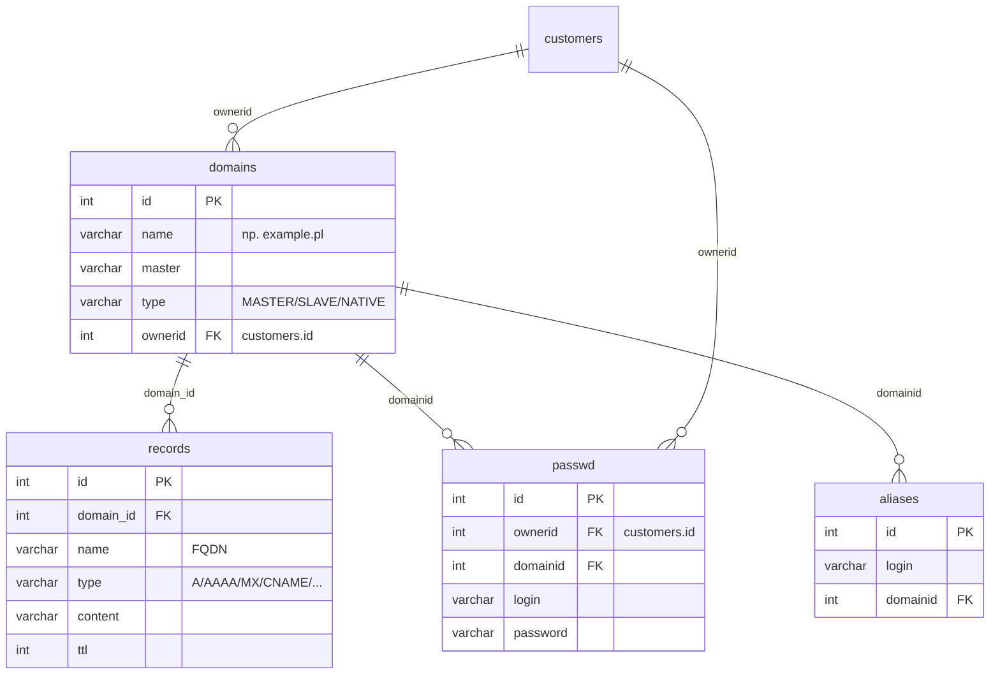

# LMS - Model danych

**Baza danych:** PostgreSQL / MySQL
**Tabel:** 163 | **Relacji FK:** 272 | **Widoków:** ~15
**Wersja schematu:** 2026031600

---

## 1. Diagram ERD - Klastry domenowe (przegląd)

```mermaid
erDiagram
    %% ===== CORE IDENTITY =====
    users ||--o{ userdivisions : "userid"
    divisions ||--o{ userdivisions : "divisionid"
    divisions }o--|| addresses : "address_id"
    users ||--o{ userassignments : "userid"
    usergroups ||--o{ userassignments : "usergroupid"

    %% ===== CUSTOMER CLUSTER =====
    customers }o--o| divisions : "divisionid"
    customers }o--o| users : "creatorid"
    customers ||--o{ customer_addresses : "customer_id"
    addresses ||--o{ customer_addresses : "address_id"
    customers ||--o{ customercontacts : "customerid"
    customers ||--o{ customerconsents : "customerid"
    customers ||--o{ customerextids : "customerid"
    customers ||--o{ customerassignments : "customerid"
    customergroups ||--o{ customerassignments : "customergroupid"
    customers ||--o{ customernotes : "customerid"

    %% ===== NETWORK CLUSTER =====
    customers ||--o{ nodes : "ownerid"
    nodes }o--|| networks : "netid"
    nodes }o--o| netdevices : "netdev"
    nodes ||--o{ macs : "nodeid"
    nodes ||--o{ nodesessions : "nodeid"
    customers ||--o{ nodesessions : "customerid"
    nodes ||--o{ nodeassignments : "nodeid"
    netdevices ||--o{ netlinks : "src/dst"
    netnodes ||--o{ netdevices : "netnodeid"

    %% ===== FINANCE CLUSTER =====
    customers ||--o{ assignments : "customerid"
    tariffs ||--o{ assignments : "tariffid"
    taxes ||--o{ tariffs : "taxid"
    assignments ||--o{ nodeassignments : "assignmentid"
    customers ||--o{ documents : "customerid"
    divisions ||--o{ documents : "divisionid"
    documents ||--o{ invoicecontents : "docid"
    documents ||--o{ cash : "docid"
    customers ||--o{ cash : "customerid"

    %% ===== KSEF CLUSTER =====
    ksefbatchsessions ||--o{ ksefdocuments : "batchsessionid"
    documents ||--o{ ksefdocuments : "docid"
    divisions ||--o{ ksefdelays : "divisionid"
    divisions ||--o{ ksefinvoices : "division_id"
    ksefinvoices ||--o{ ksefinvoiceitems : "ksef_invoice_id"
    ksefinvoices ||--o{ ksefinvoicesummaries : "ksef_invoice_id"
    ksefinvoices ||--o{ ksefinvoicetagassignments : "ksef_invoice_id"
    ksefinvoicetags ||--o{ ksefinvoicetagassignments : "ksef_invoice_tag_id"

    %% ===== HELPDESK CLUSTER =====
    customers ||--o{ rttickets : "customerid"
    rtqueues ||--o{ rttickets : "queueid"
    rttickets ||--o{ rtmessages : "ticketid"
    rtmessages ||--o{ rtattachments : "messageid"
    rtcategories ||--o{ rtticketcategories : "categoryid"
```

---

## 2. Klaster: Tożsamość i organizacja

**Kluczowa relacja:** Użytkownik MUSI być przypisany do co najmniej jednej division via `userdivisions`, aby widzieć klientów tej division.

---

## 3. Klaster: Klient (CRM)

---

## 4. Klaster: Sieć i urządzenia

**Widok `vnodes`:** Łączy `nodes` + `macs` (array_agg) + `addresses`. Używany przez RADIUS.

**Widok `nas`:** Łączy `nodes` (nas=1) + `netdevices` — eksponuje NAS-y dla FreeRADIUS.

---

## 5. Klaster: Finanse i fakturowanie

**Kluczowe relacje:**
- `assignments` łączy `customers` ↔ `tariffs` (kto ma jaką taryfę)
- `nodeassignments` łączy `nodes` ↔ `assignments` (który węzeł korzysta z której taryfy)
- RADIUS używa łańcucha: `vnodes` → `nodeassignments` → `assignments` → `tariffs` do obliczenia `Mikrotik-Rate-Limit`

---

## 6. Klaster: KSeF (e-Faktury)

---

## 7. Klaster: Helpdesk (RT)

---

## 8. Klaster: VoIP

---

## 9. Klaster: DNS / Hosting

---

## 10. Widoki (VIEWs)

| Widok | Tabele bazowe | Przeznaczenie |
|-------|---------------|---------------|
| `vnodes` | `nodes` + `macs` (array_agg) + `addresses` | Główny widok węzłów — RADIUS |
| `vmacs` | `nodes` + `macs` (JOIN) + `addresses` | Widok per-MAC (wiele wierszy/MAC) |
| `nas` | `nodes` (nas=1) + `netdevices` | Lista NAS-ów dla FreeRADIUS |
| `vdivisions` | `divisions` + `addresses` | Dane firm z adresami |
| `vaddresses` | `addresses` + `location_cities` + `location_streets` + `location_states` | Pełne adresy z TERYT |
| `customerview` | `customers` + agregaty | Widok klientów z saldem i dodatkowymi danymi |

---

## 11. Statystyki modelu

| Metryka | Wartość |
|---------|---------|
| Tabel | 163 |
| Relacji FK | 272 |
| Widoków | ~15 |
| Sekwencji | ~120 |
| Indeksów | ~200 |
| Funkcji custom | `inet_aton()`, `inet_ntoa()`, `mask2prefix()`, `broadcast()` |
| Migracji | 1466+ (2004-2026) |

### Tabele z największą liczbą FK (zależności):

| Tabela | Ilość FK wychodzących | Główne zależności |
|--------|----------------------|-------------------|
| `rttickets` | 11 | customers, users(5x), rtqueues, nodes, netdevices, addresses, invprojects, rttickets |
| `documents` | 10 | customers, users(3x), divisions, countries(2x), numberplans, addresses(2x), documents |
| `events` | 10 | customers, users(3x), divisions, nodes, netdevices, netnodes, addresses, rttickets |
| `nodes` | 8 | customers, networks, netdevices, users(2x), addresses, invprojects, netradiosectors |
| `assignments` | 7 | customers, tariffs, liabilities, numberplans, promotionschemas, addresses, documents |
| `cash` | 6 | customers, documents, users, taxes, cashimport, cashsources |

### Tabele z największą liczbą FK przychodzących (referencje DO nich):

| Tabela | Ilość referencji | Rola |
|--------|-----------------|------|
| `customers` | 25+ | Centralny podmiot systemu |
| `users` | 25+ | Twórca/modyfikator wszędzie |
| `divisions` | 10+ | Filtr widoczności, jednostka organizacyjna |
| `addresses` | 10+ | Uniwersalny adres (TERYT) |
| `nodes` | 8+ | Punkt styku klient-sieć |
| `documents` | 7+ | Kontener faktur/dokumentów |
